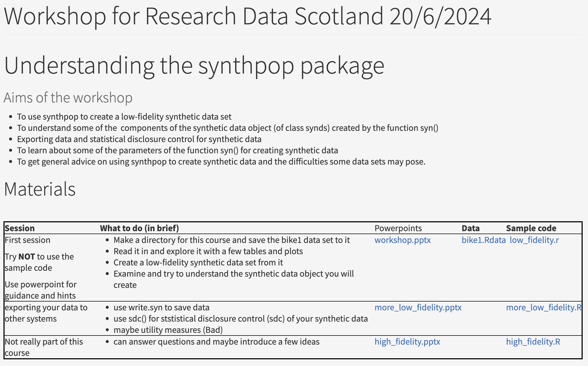

# Workshop on synthetic data (by Prof Gillian Raab)

## Overview

* `Data/bike1.rdta` provided by workshop is from https://usmart.io/org/cyclingscotland/discovery/discovery-view-detail/bc613ae3-3325-4f19-92b0-d03f68459200

* `slides/` contains PowerPoint presentations provided by the workshop.

* `scripts/provided_by_workshop` contains scripts provided by the workshop.

* `scripts/synthetic_data_workshop.Rmd` contains my code and notes taken during the workshop.
